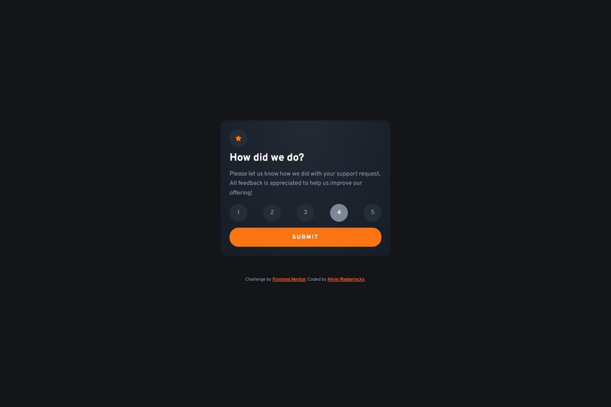
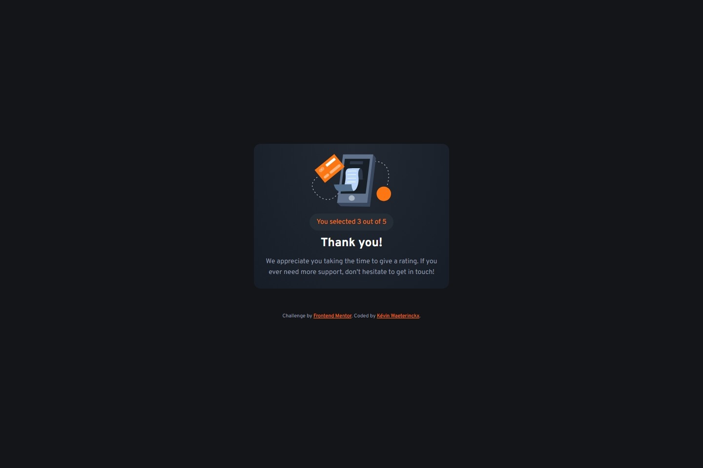
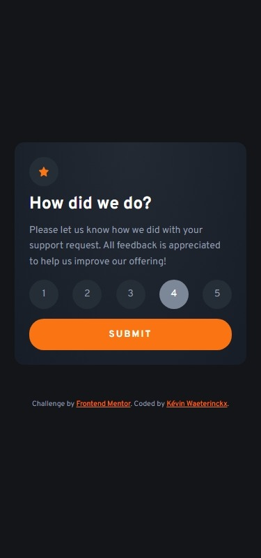

# Frontend Mentor - Interactive rating component solution

This is a solution to the [Interactive rating component challenge on Frontend Mentor](https://www.frontendmentor.io/challenges/interactive-rating-component-koxpeBUmI). Frontend Mentor challenges help you improve your coding skills by building realistic projects. 

## Table of contents

- [Overview](#overview)
  - [The challenge](#the-challenge)
  - [Screenshot](#screenshot)
  - [Links](#links)
- [My process](#my-process)
  - [Built with](#built-with)
  - [What I learned](#what-i-learned)
  - [Continued development](#continued-development)
- [Author](#author)

## Overview

### The challenge

Users should be able to:

- View the optimal layout for the app depending on their device's screen size
- See hover states for all interactive elements on the page
- Select and submit a number rating
- See the "Thank you" card state after submitting a rating

### Screenshot

### Links

- Solution URL: [Code on GitHub](https://github.com/kwaeterinckx/FMC-InteractiveRatingComponent)
- Live Site URL: [Live version](https://genuine-marshmallow-a28ded.netlify.app/)

## My process

### Built with

- Semantic HTML5 markup
- CSS custom properties
- Flexbox
- CSS Grid
- Mobile-first workflow

### What I learned

I used a very small and easy script to get the result out of the URL.

### Continued development

I'm learning the way to it better and to manipulate the form with JS.

## Author

Kévin Waeterinckx

- Frontend Mentor - [@kwaeterinckx](https://www.frontendmentor.io/profile/kwaeterinckx)
- GitHub - [kwaeterinckx](https://github.com/kwaeterinckx)
- LinkedIn - [Kévin Waeterinckx](https://www.linkedin.com/in/kévin-waeterinckx-58256518a)